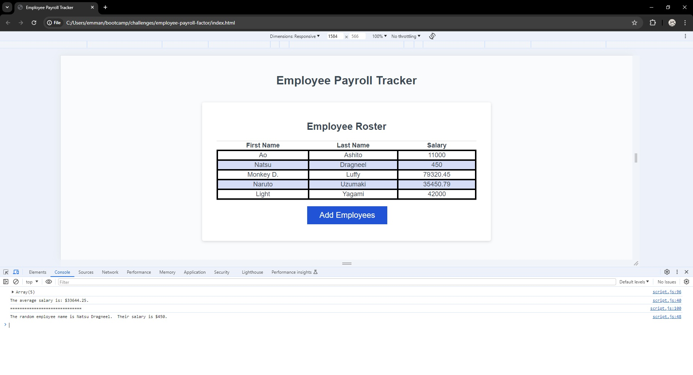

# employee-payroll-factor
The goal of this project was to build a webpage that can prompt the user asking for the employee first name, last name, and salary.  This webpage will prompt the user asking for the employee information, then will log the information on a table on the screen.  The website will also be able to log the average salary, and give the user a random employee in the console.

This application is a website of a employee payroll.

There was many challenges that occurred, while building the website.  One challenge was figuring out how to push the information that was given into an array, and how that would look/be formatted.  The solution to that problem was creating a function that could push an object into the array.  

